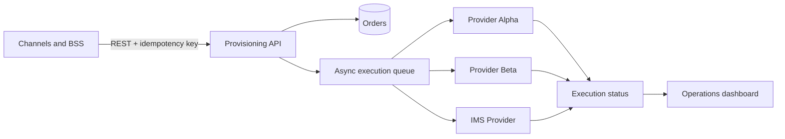

# Telco Provisioning Platform

An event-driven, provider-agnostic provisioning platform built as a clean-room portfolio project. It demonstrates how telecom operations can be routed, observed and safely retried across multiple downstream providers.

> This repository contains original code and synthetic data. It does not contain employer source code, production configuration, credentials, customer data, real provider contracts or proprietary endpoints.

## Why this project exists

Provisioning flows tend to grow as point-to-point integrations. That makes failures hard to trace, provider changes risky and operational status invisible. This project centralizes those concerns in a small orchestration layer and exposes the result through an operations dashboard.

## Capabilities

- Provider-neutral activation, deactivation, blocking and unblocking
- Fan-out to `provider-alpha`, `provider-beta` and `ims-provider`
- Request-level idempotency
- Per-target execution status and correlation IDs
- Retry-safe asynchronous processing
- Operational metrics and a live dashboard
- Synthetic failure scenarios for demonstrations
- OpenAPI documentation and automated tests

## Architecture



## Run locally

```bash
npm install
npm run dev
```

- API: `http://localhost:3001`
- OpenAPI: `http://localhost:3001/docs`
- Dashboard: `http://localhost:5173`

Create a demo order:

```bash
curl -X POST http://localhost:3001/v1/orders \
  -H "content-type: application/json" \
  -H "idempotency-key: demo-activation-001" \
  -d '{"subscriberId":"sub-demo-1001","operation":"ACTIVATE","targets":["provider-alpha","ims-provider"]}'
```

## Engineering decisions

- [ADR 001: provider-neutral orchestration](docs/adr/001-provider-neutral-orchestration.md)
- [Public portfolio safety policy](SECURITY.md)

## Roadmap

- PostgreSQL persistence and transactional outbox
- LocalStack/SQS adapter alongside the in-memory queue
- Exponential retry and dead-letter recovery console
- OpenTelemetry traces
- Role-based dashboard access

## License

MIT. The fictional provider names and synthetic examples exist solely for demonstration.
